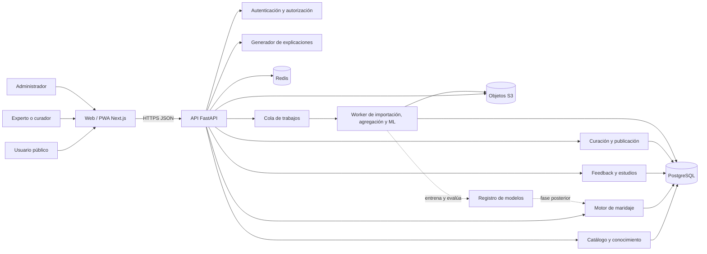
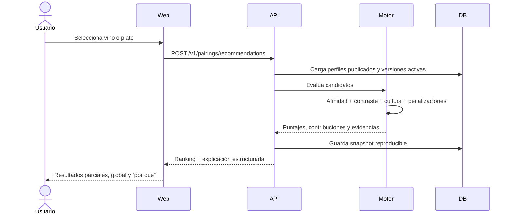
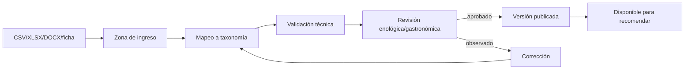
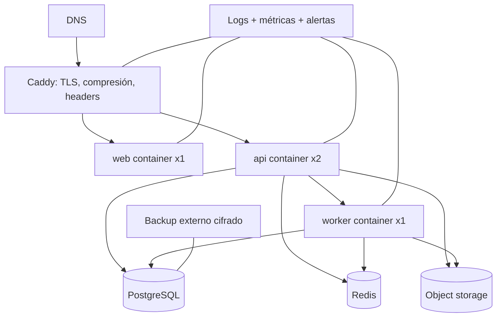

# Arquitectura de la plataforma inteligente de maridaje boliviano

> Documento vivo de arquitectura (versión inicial).  
> Fuente funcional: `ENOLOGIA - IA.docx`.  
> Estado del repositorio al iniciar este documento: vacío; no existe una implementación previa que condicione las decisiones.

## 1. Propósito y alcance

Este documento convierte el requerimiento enológico y funcional recibido en una arquitectura implementable para una plataforma web que recomiende maridajes entre vinos bolivianos y platos bolivianos.

La plataforma debe:

- almacenar conocimiento enológico, gastronómico, bioquímico, territorial y cultural;
- comparar perfiles sensoriales de vinos y perfiles organolépticos de platos;
- calcular por separado afinidad, contraste favorable y compatibilidad cultural;
- producir una recomendación global sin ocultar las puntuaciones parciales;
- explicar cada recomendación con evidencia trazable;
- admitir consultas por vino, por plato y por territorio;
- recopilar evaluaciones de expertos y consumidores;
- evolucionar de un motor experto determinista a modelos de aprendizaje automático explicables;
- preservar datos aptos para investigación académica.

La primera entrega será una aplicación web responsive/PWA, una API, un panel de curación, un motor explicable basado en reglas, una base de datos relacional y una canalización reproducible de despliegue.

## 2. Separación entre requisitos y decisiones de arquitectura

### 2.1 Requisitos explícitos del documento fuente

Los siguientes puntos son obligatorios porque proceden del documento:

1. El dominio inicial incluye vinos del Valle de Cinti, Valle Central de Tarija y, progresivamente, otros valles bolivianos.
2. Cada vino posee información general, elaboración, fermentación, crianza, apariencia, aromas, boca y descriptores globales.
3. Cada plato posee región, sabores básicos, intensidad, grasa, picor, familias aromáticas, textura, técnica culinaria e ingredientes dominantes.
4. Existen tres dimensiones independientes de maridaje: afinidad/complemento, contraste favorable y vínculo cultural/territorial.
5. Cada dimensión se puntúa de 0 a 100 y debe permanecer visible aunque exista un índice global.
6. Cada recomendación debe explicar coincidencias, contrastes, incompatibilidades, intensidad relativa y componente cultural.
7. Se deben soportar las modalidades “Tengo este vino”, “Tengo este plato” y “Explorar Bolivia”.
8. La versión inicial se basa en conocimiento sensorial y reglas definidas por expertos.
9. El aprendizaje automático se incorpora después, a partir de catas, paneles, profesionales, consumidores y evaluaciones de 1 a 5.
10. El modelo debe ser explicable y los datos deben conservar valor académico y científico.

### 2.2 Decisiones propuestas en este documento

Estas decisiones no aparecen literalmente en la fuente; se adoptan para hacer el sistema construible, mantenible y verificable:

- monolito modular en el MVP, con fronteras de dominio claras;
- frontend con Next.js y TypeScript;
- backend con FastAPI y Python;
- PostgreSQL como fuente de verdad;
- Redis sólo para caché, rate limiting y trabajos asíncronos;
- almacenamiento compatible con S3 para imágenes y documentos de respaldo;
- motor de reglas versionado, determinista y puro;
- arquitectura híbrida posterior: reglas + modelo de ranking, nunca un LLM como autoridad de puntuación;
- despliegue inicial con contenedores Docker en un servidor Linux, Caddy como proxy TLS y PostgreSQL administrado o aislado;
- repositorio único con contratos OpenAPI y migraciones versionadas;
- observabilidad, auditoría, consentimiento y anonimización desde el diseño.

### 2.3 Supuestos que deben validarse con la responsable del proyecto

- La interfaz inicial será en español; se deja preparada la internacionalización.
- El contenido público será consultable sin cuenta. Evaluar, guardar favoritos o administrar contenido requerirá autenticación.
- Los puntajes sensoriales usarán internamente una escala normalizada `[0, 1]`, aunque la UI muestre categorías o valores de 0 a 100.
- Los registros importados desde fichas o publicaciones no se publicarán sin fuente, fecha y estado de revisión.
- La plataforma no venderá alcohol ni procesará pagos durante el MVP.
- Las recomendaciones son educativas y sensoriales, no médicas ni nutricionales.
- La base de datos distinguirá afirmaciones documentadas de inferencias del equipo curador.

## 3. Principios arquitectónicos

1. **Explicabilidad antes que sofisticación.** Todo punto concedido o descontado debe producir una contribución legible y auditable.
2. **Conocimiento versionado.** Taxonomías, reglas, pesos y perfiles cambian sin sobrescribir el pasado.
3. **Fuente de verdad única.** PostgreSQL conserva entidades, revisiones, reglas, resultados, feedback y procedencia.
4. **LLM fuera del camino crítico.** Un modelo generativo puede mejorar redacción o búsqueda semántica, pero no inventa atributos ni decide el puntaje oficial.
5. **Privacidad por defecto.** El feedback científico se separa de la identidad operativa del usuario.
6. **Monolito modular primero.** El dominio no justifica microservicios en la etapa inicial; se diseñan límites que permitan extraer componentes si la carga lo exige.
7. **Reproducibilidad.** Una recomendación debe poder recalcularse con las mismas versiones de datos, taxonomía, reglas y pesos.
8. **Accesibilidad y baja conectividad.** Diseño responsive, HTML semántico, carga progresiva, caché de lectura y PWA opcional.

## 4. Vista general del sistema



### Flujo central de recomendación



## 5. Arquitectura lógica por dominios

### 5.1 Catálogo enológico

Responsabilidades:

- bodegas, vinos, añadas, regiones, valles y municipios;
- variedades de uva y composición de blends;
- técnicas de elaboración, fermentación, maloláctica y crianza;
- perfiles de apariencia, nariz y boca;
- fuentes documentales y nivel de confianza;
- publicación y vigencia de cada versión del perfil.

Regla importante: “vino comercial” y “perfil de añada” no son lo mismo. Un vino puede tener varias añadas, y cada añada puede tener un perfil sensorial distinto. Si no existe añada, se crea un perfil genérico explícitamente marcado como tal.

### 5.2 Catálogo gastronómico

Responsabilidades:

- platos, variantes regionales, departamentos y localidades;
- ingredientes dominantes y alérgenos informativos;
- sabores, grasa, picor, intensidad, aromas y texturas;
- técnicas culinarias;
- fuentes y versiones del perfil organoléptico.

Un plato no debe modelarse como una ficha inmutable: “sopa de maní” puede tener variantes con intensidades, carnes o técnicas distintas. `dish` representa el concepto y `dish_variant` la preparación evaluable.

### 5.3 Ontología sensorial y bioquímica

Responsabilidades:

- vocabulario controlado de descriptores;
- familias y sinónimos: por ejemplo `cassis` y `grosella_negra`;
- dimensiones cuantitativas normalizadas;
- vínculos descriptor–compuesto–proceso–microorganismo;
- relaciones jerárquicas y equivalencias;
- traducciones futuras.

La ontología evita comparar texto libre. “Aterciopelado”, “tanino fino” y “astringencia baja” pueden estar relacionados, pero no son idénticos. Cada relación debe declarar tipo, fuerza, fuente y versión.

### 5.4 Motor de maridaje

Responsabilidades:

- recuperar candidatos elegibles;
- transformar perfiles versionados a vectores sensoriales canónicos;
- ejecutar reglas de afinidad, contraste, cultura e incompatibilidad;
- normalizar puntajes a 0–100;
- aplicar pesos versionados;
- generar contribuciones positivas y negativas;
- ordenar resultados;
- persistir el snapshot de cálculo.

### 5.5 Explicaciones

La explicación se construye primero como datos estructurados, no como prosa:

```json
{
  "dimension": "contrast",
  "rule_code": "ACIDITY_BALANCES_FAT",
  "wine_attribute": {"code": "acidity", "value": 0.82},
  "dish_attribute": {"code": "fat", "value": 0.76},
  "contribution": 14.2,
  "evidence": ["wine_profile_version:184", "dish_profile_version:93"],
  "message_key": "pairing.contrast.acidity_fat"
}
```

La API convierte estas contribuciones en mensajes mediante plantillas revisadas. Un LLM opcional podrá variar la redacción, pero recibirá sólo hechos permitidos y su salida será validada contra el objeto estructurado. Si falla, se utiliza siempre la plantilla determinista.

### 5.6 Feedback e investigación

Responsabilidades:

- evaluaciones de 1 a 5;
- rol declarado del evaluador: consumidor, sommelier, enólogo, gastrónomo, panelista, etc.;
- contexto de cata: fecha, ciega/no ciega, muestra, preparación y condiciones;
- consentimiento y finalidad de uso;
- cohortes o estudios;
- exportaciones anonimizadas y diccionario de datos;
- control de calidad de observaciones.

Una valoración informal no debe mezclarse sin más con un panel sensorial controlado. Ambas se guardan, pero con distinto tipo de evidencia y ponderación.

### 5.7 Administración y curación

Estados de contenido:

`draft -> in_review -> approved -> published -> archived`

Sólo un curador autorizado puede aprobar; sólo un administrador puede publicar o retirar. Cada transición genera un evento de auditoría con actor, fecha, versión previa y motivo.

## 6. Modelo de datos

### 6.1 Núcleo relacional

| Área | Entidades principales | Observaciones |
|---|---|---|
| Geografía | `country`, `department`, `region`, `valley`, `municipality`, `place` | Jerarquía flexible; coordenadas opcionales |
| Vino | `winery`, `wine`, `wine_vintage`, `grape_variety`, `wine_grape` | Blend con porcentaje y procedencia |
| Elaboración | `vinification`, `fermentation`, `aging`, `vessel_type` | Muchos procesos por añada |
| Gastronomía | `dish`, `dish_variant`, `ingredient`, `dish_ingredient`, `culinary_technique` | Variante regional evaluable |
| Sensorial | `sensory_term`, `sensory_family`, `sensory_relation`, `profile`, `profile_measurement` | Vocabulario controlado y valores normalizados |
| Bioquímica | `compound`, `compound_family`, `microorganism`, `biochemical_process`, `sensory_mechanism` | Explicaciones con fuentes |
| Cultura | `cultural_link`, `tradition`, `territorial_evidence` | No inferir tradición sólo por coincidencia geográfica |
| Reglas | `rule_set`, `pairing_rule`, `weight_profile`, `rule_test_case` | Versionado, vigencia y pruebas |
| Resultados | `recommendation_run`, `candidate_score`, `score_contribution`, `explanation_snapshot` | Reproducibilidad completa |
| Evidencia | `source`, `citation`, `claim`, `review` | Procedencia por dato o afirmación |
| Usuarios | `user`, `role`, `consent`, `favorite`, `rating` | Identidad separada de dataset científico |
| ML | `dataset_version`, `feature_schema`, `model_version`, `model_metric`, `prediction_log` | Sólo fase posterior |
| Operación | `audit_event`, `outbox_event`, `import_job` | Auditoría e integraciones fiables |

### 6.2 Perfil sensorial canónico

Cada medición guarda:

- `profile_id` y versión;
- `attribute_code` o `sensory_term_id`;
- `value_normalized` entre 0 y 1;
- valor original y escala original;
- método: laboratorio, panel, ficha técnica, inferencia curada o usuario;
- incertidumbre o intervalo, cuando exista;
- fuente y fecha;
- persona revisora;
- estado de publicación.

Dimensiones numéricas mínimas para vino:

`sweetness`, `acidity`, `alcohol`, `tannin`, `astringency`, `body`, `intensity`, `texture_weight`, `persistence`, `effervescence`.

Dimensiones numéricas mínimas para plato:

`sweet`, `acid`, `salty`, `bitter`, `umami`, `intensity`, `fat`, `heat`, `texture_weight`.

Los aromas, texturas y técnicas se representan como términos controlados con intensidad y confianza. No deben comprimirse en una única columna JSON sin índices ni validación; JSONB queda reservado para metadatos de fuente o atributos experimentales.

### 6.3 Procedencia y calidad

Todo dato publicable debe responder:

- ¿quién lo incorporó?;
- ¿de qué fuente proviene?;
- ¿se refiere a una añada o preparación concreta?;
- ¿es medición, descripción editorial o inferencia?;
- ¿quién lo revisó?;
- ¿qué versión estaba activa al producir una recomendación?

Niveles de confianza sugeridos:

- `A`: medición o panel documentado y revisado;
- `B`: ficha técnica de productor o publicación especializada;
- `C`: descripción curada con evidencia parcial;
- `D`: dato comunitario todavía no validado.

## 7. Diseño del motor de recomendación

### 7.1 Etapa 1: motor experto determinista

El motor recibe un perfil de origen, un conjunto de candidatos, un `rule_set_version` y un `weight_profile_version`. Devuelve puntajes y contribuciones.

```text
entrada -> validación -> normalización -> filtros duros -> reglas por dimensión
        -> penalizaciones -> normalización 0..100 -> ranking -> explicación
```

Pseudocódigo:

```python
for candidate in candidates:
    affinity = evaluate_rules("affinity", wine, dish, rules)
    contrast = evaluate_rules("contrast", wine, dish, rules)
    culture = evaluate_rules("culture", wine, dish, rules)
    penalties = evaluate_rules("incompatibility", wine, dish, rules)

    partial = normalize_each(affinity, contrast, culture)
    global_score = weighted_sum(partial, active_weights) - penalties.total
    result = explain_and_snapshot(partial, global_score, all_contributions)
```

### 7.2 Familias de reglas iniciales

**Afinidad/complemento**

- intensidad de vino semejante a intensidad del plato;
- aromas compartidos o compatibles;
- textura y cuerpo equivalentes;
- crianza/tostado con asado, parrilla o ahumado;
- especias compatibles;
- componente frutal con ingredientes o salsas frutales.

**Contraste favorable**

- acidez frente a grasa;
- dulzor frente a picor;
- efervescencia frente a fritura y grasa;
- frescura frente a intensidad;
- taninos frente a proteínas y grasa, con control de exceso;
- textura cremosa frente a acidez que refresca.

**Cultura/territorio**

- misma región o corredor geográfico;
- tradición documentada;
- ingredientes y paisaje productivo compartidos;
- evidencia patrimonial;
- vínculo editorial revisado.

**Incompatibilidades/penalizaciones**

- tanino alto con picor intenso;
- vino menos dulce que un postre;
- delicadeza aromática frente a plato extremadamente intenso;
- alcohol alto con picor elevado;
- amargor acumulado;
- baja confianza o datos incompletos.

Las incompatibilidades no se esconden dentro del puntaje: aparecen en una sección “Consideraciones”.

### 7.3 Fórmula y calibración

Para la primera versión:

```text
global = 0.40 * afinidad + 0.40 * contraste + 0.20 * cultura - penalización
```

Es un punto de partida propuesto, no una verdad enológica. Los pesos deben calibrarse mediante casos de prueba aprobados por expertos. El sistema debe permitir perfiles alternativos, por ejemplo `técnico`, `cultural` o `turístico`, sin cambiar las puntuaciones parciales.

Cada regla define:

- código estable;
- dimensión;
- precondiciones;
- función de puntuación;
- máximo de contribución;
- prioridad y reglas incompatibles;
- plantilla explicativa;
- evidencia científica o experta;
- versión y vigencia;
- casos positivos, negativos y de borde.

### 7.4 Gestión de datos incompletos

No se interpreta “dato ausente” como cero. El resultado incluye:

- `coverage`: porcentaje de variables requeridas disponibles;
- `confidence`: confianza agregada de las fuentes;
- `score`: compatibilidad calculada sólo sobre reglas evaluables;
- advertencia cuando el ranking no sea comparable por cobertura insuficiente.

### 7.5 Fase 2: aprendizaje automático explicable

Cuando exista un volumen suficiente y representativo de evaluaciones:

1. congelar un dataset versionado y anonimizado;
2. separar por usuarios, vinos y platos para evitar fuga de información;
3. entrenar primero baselines interpretables: regresión ordinal, modelos lineales regularizados y árboles de gradiente;
4. comparar contra el motor experto, no sólo contra una media global;
5. calibrar predicciones y medir error por región, tipo de vino, plato y rol del evaluador;
6. usar SHAP o contribuciones equivalentes para explicación del componente ML;
7. desplegar como “shadow model” antes de influir en el ranking;
8. promover sólo modelos que superen umbrales aprobados y no degraden subgrupos.

Arquitectura híbrida propuesta:

```text
puntaje final = restricciones expertas + ranking ML calibrado + componente cultural verificable
```

El ML puede reordenar candidatos dentro de límites; no debe violar restricciones fuertes ni fabricar un vínculo cultural.

### 7.6 Uso responsable de IA generativa

Usos permitidos:

- sugerir borradores de descriptores para revisión humana;
- ayudar a mapear texto de fuentes al vocabulario controlado;
- búsqueda semántica sobre contenido aprobado;
- redactar una explicación a partir de contribuciones ya calculadas.

Usos no permitidos:

- crear puntajes oficiales directamente;
- completar datos faltantes como si fueran hechos;
- declarar tradición cultural sin evidencia;
- publicar contenido sin revisión;
- usar datos personales o feedback no consentido en prompts externos.

Si se incorpora recuperación semántica, `pgvector` puede almacenar embeddings junto con la información relacional; su uso es auxiliar y no sustituye filtros, relaciones ni reglas del dominio.

## 8. Backend

### 8.1 Tecnología

- Python 3.x y FastAPI;
- Pydantic para contratos y validación;
- SQLAlchemy 2 y Alembic para persistencia y migraciones;
- PostgreSQL;
- Redis;
- worker Python para importaciones, agregaciones, exportaciones y ML;
- OpenAPI como contrato publicado.

Python concentra API, ciencia de datos y ML, evitando duplicar la lógica sensorial entre lenguajes. FastAPI permite contratos tipados y documentación OpenAPI; la lógica de dominio, sin embargo, no dependerá del framework.

### 8.2 Capas internas

```text
apps/api             adaptadores HTTP y composición
modules/catalog      vinos, platos, geografía y taxonomía
modules/pairing      reglas, puntajes y explicaciones
modules/evidence     fuentes, afirmaciones y revisiones
modules/feedback     usuarios, estudios y evaluaciones
modules/admin        flujo editorial y auditoría
modules/ml           datasets, entrenamiento e inferencia futura
platform/db          ORM, migraciones y transacciones
platform/cache       caché y rate limiting
platform/storage     objetos
platform/observability logs, métricas y trazas
```

Cada módulo separa `domain`, `application` e `infrastructure`. El motor de maridaje debe poder ejecutarse en pruebas sin API, base de datos ni red.

### 8.3 API inicial

| Método | Ruta | Propósito |
|---|---|---|
| `GET` | `/v1/wines` | listar y filtrar vinos publicados |
| `GET` | `/v1/wines/{slug}` | ficha, perfil, fuente y versiones públicas |
| `GET` | `/v1/dishes` | listar y filtrar platos/variantes |
| `GET` | `/v1/dishes/{slug}` | ficha organoléptica y territorial |
| `GET` | `/v1/regions` | exploración territorial |
| `POST` | `/v1/pairings/recommendations` | ranking en cualquiera de los dos sentidos |
| `GET` | `/v1/pairings/runs/{id}` | resultado reproducible |
| `POST` | `/v1/ratings` | valoración con consentimiento y contexto |
| `GET` | `/v1/me/favorites` | favoritos del usuario |
| `POST` | `/v1/admin/imports` | importar dataset validable |
| `POST` | `/v1/admin/content/{id}/submit` | enviar a revisión |
| `POST` | `/v1/admin/content/{id}/approve` | aprobar versión |
| `POST` | `/v1/admin/content/{id}/publish` | publicar versión |

Ejemplo de solicitud:

```json
{
  "mode": "wine_to_dishes",
  "wine_vintage_id": "018f...",
  "limit": 10,
  "weight_profile": "balanced-v1",
  "filters": {"department_codes": ["TJA", "CHQ"]}
}
```

Ejemplo de respuesta:

```json
{
  "run_id": "0190...",
  "engine_version": "rules-1.0.0",
  "source_profile_version": 12,
  "results": [{
    "dish_variant_id": "018e...",
    "scores": {
      "affinity": 87,
      "contrast": 91,
      "culture": 95,
      "global": 90
    },
    "coverage": 0.89,
    "confidence": 0.84,
    "predominant_types": ["contrast", "affinity"],
    "reasons": [],
    "considerations": []
  }]
}
```

### 8.4 Transacciones y eventos

- Publicar una versión y actualizar su puntero activo ocurre en una transacción.
- Los eventos destinados al worker se escriben mediante patrón transactional outbox.
- Las recomendaciones son idempotentes cuando reciben `Idempotency-Key`.
- Los trabajos de importación guardan fila, error, versión de esquema y archivo original.

## 9. Frontend web

### 9.1 Tecnología y enfoque

- Next.js con App Router y TypeScript;
- renderizado del lado del servidor para fichas públicas y SEO;
- componentes cliente sólo para filtros, comparadores, mapas y evaluaciones;
- cliente generado o tipado desde OpenAPI;
- sistema de diseño accesible con tokens, no estilos aislados;
- PWA opcional para caché de fichas y últimas consultas.

### 9.2 Arquitectura de interfaz

```text
app/
  (public)/
    vinos/
    platos/
    maridajes/
    explorar-bolivia/
    aprender/
  (account)/
    favoritos/
    evaluaciones/
  (admin)/
    catalogo/
    revisiones/
    reglas/
    importaciones/
features/
  wine-catalog/
  dish-catalog/
  pairing-explorer/
  sensory-profile/
  cultural-map/
  rating/
shared/
  api/ ui/ auth/ i18n/ analytics/
```

### 9.3 Experiencias principales

**Tengo este vino**

1. Buscar o escanear catálogo.
2. Elegir vino y, si existe, añada.
3. Ajustar región o preferencias opcionales.
4. Ver platos ordenados.
5. Abrir explicación: afinidad, contraste, cultura, incompatibilidades y evidencia.

**Tengo este plato**

El mismo patrón, invirtiendo la entidad de origen y mostrando vinos/añadas elegibles.

**Explorar Bolivia**

Departamento/región → platos → vinos → vínculos culturales documentados. El mapa no reemplaza una lista accesible y navegable por teclado.

**Resultado**

- encabezado con vino + plato;
- recomendación verbal y nivel global;
- tres puntajes independientes;
- “Por qué funciona” con contribuciones concretas;
- “Qué considerar” con posibles conflictos;
- perfil comparado de intensidad, acidez, grasa, picor, cuerpo y tanino;
- componente cultural separado de la compatibilidad técnica;
- fuentes y fecha de los perfiles;
- acción de evaluar de 1 a 5.

### 9.4 Estado y datos

- El servidor resuelve contenido público y metadatos iniciales.
- Un gestor de consultas cliente administra búsquedas, mutaciones, reintentos y caché de sesión.
- Los filtros relevantes viven en la URL para permitir compartir resultados.
- No se guarda un puntaje calculado sólo en el navegador; el backend es la autoridad.
- Formularios administrativos usan validación compartida derivada del contrato, además de validación de servidor.

### 9.5 Accesibilidad y rendimiento

- objetivo WCAG 2.2 AA;
- contraste, foco visible, navegación por teclado y lectores de pantalla;
- gráficos acompañados de valores y texto equivalente;
- imágenes responsive y diferidas;
- presupuestos de rendimiento por ruta;
- skeletons no invasivos y estados de error útiles;
- formatos modernos con alternativa;
- no depender del color para comunicar puntajes.

## 10. Autenticación, autorización y seguridad

### 10.1 Roles

| Rol | Capacidades |
|---|---|
| Visitante | consultar catálogos y recomendaciones públicas |
| Usuario | evaluar, guardar favoritos y gestionar su consentimiento |
| Investigador | acceder a estudios/datasets autorizados y anonimizados |
| Curador | crear y revisar contenido y fuentes |
| Publicador | aprobar publicación o retiro |
| Administrador | usuarios, roles, configuración y auditoría |

Se aplica RBAC y, para estudios, comprobaciones adicionales por organización/cohorte.

### 10.2 Controles

- HTTPS obligatorio y HSTS;
- cookies de sesión `HttpOnly`, `Secure` y `SameSite`;
- protección CSRF en operaciones autenticadas basadas en cookie;
- CORS restringido;
- rate limiting por IP, usuario y operación;
- validación estricta y consultas parametrizadas;
- subida de archivos con tipo/tamaño permitidos, nombre aleatorio y análisis antes de publicar;
- secretos fuera del repositorio;
- cifrado en tránsito y en reposo;
- copias cifradas y restauraciones probadas;
- logs sin tokens, contraseñas ni respuestas sensibles;
- MFA obligatorio para administradores;
- dependencia y contenedor escaneados en CI;
- encabezados CSP, `X-Content-Type-Options`, protección contra framing y política de referencias.

### 10.3 Privacidad e investigación

- separar tablas de identidad de tablas de observaciones científicas;
- usar identificadores seudónimos en exports;
- registrar versión del consentimiento y posibilidad de revocación;
- minimizar demografía y permitir “prefiero no responder”;
- aplicar ventanas de retención;
- exportar sólo cohortes con umbral mínimo para reducir reidentificación;
- documentar finalidad, base de uso y responsable antes de recolectar datos de investigación.

## 11. Importación y curación de datos



Reglas de ingestión:

- conservar archivo original y hash;
- nunca publicar directamente desde una importación;
- detectar duplicados por bodega, vino, añada y variante;
- mostrar términos desconocidos para mapeo humano;
- rechazar escalas fuera de rango y unidades ambiguas;
- producir informe por fila con advertencias y errores;
- versionar el esquema de importación;
- permitir rollback lógico de un lote.

El contenido enológico ya presente en el documento fuente servirá como semilla, no como datos automáticamente “confirmados”. Debe importarse con su fuente específica y revisión, especialmente cuando un descriptor corresponde a una añada concreta.

## 12. Despliegue que realizaremos

### 12.1 Entornos

- **Local:** Docker Compose con web, API, worker, PostgreSQL, Redis y MinIO.
- **Preview:** un entorno efímero por pull request, con datos sintéticos.
- **Staging:** réplica funcional con datos anonimizados y configuración casi productiva.
- **Producción:** contenedores inmutables sobre un servidor Linux, base de datos protegida, almacenamiento de objetos, TLS y copias externas.

### 12.2 Topología inicial de producción



Decisión de primera etapa: un único servidor de aplicación con Docker Compose y Caddy; PostgreSQL puede estar en servicio administrado o en una máquina separada. No se usará Kubernetes en el MVP. Esta topología reduce operación, mantiene portabilidad y permite escalar API y workers horizontalmente antes de separar dominios.

### 12.3 Contenedores

- `web`: build standalone de Next.js, usuario no root;
- `api`: imagen Python mínima, un proceso por contenedor y réplicas externas;
- `worker`: misma base de código/imagen que API, comando distinto;
- `migrate`: tarea de una sola ejecución antes de actualizar API;
- `caddy`: terminación TLS y proxy;
- bases de datos no expuestas a Internet.

### 12.4 CI/CD

```text
pull request
  -> lint + tipos + unitarias + pruebas del motor
  -> integración con PostgreSQL/Redis
  -> contrato OpenAPI + cliente frontend
  -> pruebas E2E y accesibilidad
  -> escaneo de dependencias, secretos e imágenes
  -> build firmado e identificado por commit
merge a main
  -> staging -> smoke tests -> aprobación -> producción
  -> migración compatible -> rolling update -> verificación -> rollback si falla
```

No se ejecutará una migración destructiva en el mismo paso que despliega código que la requiere. Se empleará el patrón expandir/migrar/contraer.

### 12.5 Dominios y red

- `www.<dominio>`: interfaz pública;
- `api.<dominio>` o `/api`: API; se recomienda mismo sitio para simplificar cookies y CORS;
- `admin.<dominio>` opcional, protegido adicionalmente;
- PostgreSQL, Redis y métricas sólo en red privada;
- SSH por clave y acceso administrativo restringido;
- firewall con 80/443 públicos y administración limitada.

### 12.6 Copias, restauración y continuidad

- copias automáticas diarias y registros continuos si el proveedor lo permite;
- copia semanal externa cifrada;
- versionado/borrado protegido en objetos;
- prueba mensual de restauración en staging;
- runbook de pérdida de base, credenciales, servidor y proveedor;
- objetivo inicial propuesto: RPO de 24 horas y RTO de 8 horas; ajustar antes de producción.

### 12.7 Escalamiento futuro

Orden de escalado:

1. optimizar consultas e índices;
2. activar caché de catálogos y rankings estables;
3. aumentar recursos de PostgreSQL y API;
4. separar workers pesados;
5. réplicas de lectura y CDN para objetos;
6. extraer inferencia ML sólo si sus recursos/ciclo de despliegue lo justifican;
7. adoptar orquestación más compleja únicamente con evidencia operativa.

## 13. Observabilidad

### 13.1 Logs

JSON estructurado con:

- `timestamp`, `level`, `service`, `environment`;
- `request_id`, `trace_id`, `user_pseudonym` cuando proceda;
- ruta normalizada, estado, latencia;
- `recommendation_run_id`, `rule_set_version`, `model_version`;
- error tipado sin contenido sensible.

### 13.2 Métricas

- tráfico, tasa de error y latencia p50/p95/p99;
- pool de conexiones y consultas lentas;
- profundidad y antigüedad de cola;
- caché hit/miss;
- cobertura y confianza media de recomendaciones;
- reglas que más contribuyen o penalizan;
- tasa de aceptación/evaluación;
- deriva de datos y desempeño ML cuando exista.

### 13.3 Trazas y auditoría

Una traza conecta web → API → consulta → motor → worker. La auditoría de contenido y permisos se guarda en almacenamiento transaccional; no depende de logs efímeros.

## 14. Estrategia de pruebas

### 14.1 Pirámide

- unitarias del dominio y cada regla;
- pruebas basadas en propiedades: límites 0–100, determinismo, simetría cuando aplique;
- golden tests de maridajes aprobados por expertos;
- integración de repositorios, migraciones, caché y jobs;
- contrato API/OpenAPI;
- componentes frontend y accesibilidad;
- E2E de las tres modalidades y administración;
- carga del endpoint de recomendaciones;
- seguridad: autorización, rate limit, CSRF, archivos e inyección.

### 14.2 Casos obligatorios del motor

- Tannat de Tarija + chancho a la cruz debe explicar cuerpo/intensidad, tanino/proteína, acidez/grasa, tostado y territorio cuando los datos lo sustenten;
- vino con acidez alta + plato graso debe producir contraste positivo;
- vino dulce + plato picante puede producir contraste, pero alcohol alto puede penalizar;
- espumante + fritura debe explicar burbuja/limpieza de paladar;
- perfil sin añada o con baja cobertura debe mostrar incertidumbre;
- coincidencia regional sin afinidad técnica debe mantener cultura separada;
- fuentes contradictorias no deben fusionarse silenciosamente.

## 15. Estructura propuesta del repositorio

```text
SaraProject/
  apps/
    web/                    # Next.js
    api/                    # FastAPI y composición
    worker/                 # comandos de background
  packages/
    ui/                     # sistema de diseño
    api-client/             # cliente generado desde OpenAPI
    config/                 # ESLint, TS, convenciones
  backend/
    modules/                # dominio y casos de uso Python
    migrations/             # Alembic
    tests/
  data/
    schemas/                # plantillas de importación
    seeds/                  # datos iniciales revisables
    taxonomy/               # vocabulario controlado versionado
  ml/
    pipelines/              # preparación, entrenamiento y evaluación
    tests/
  infra/
    docker/
    compose/
    caddy/
    scripts/
  docs/
    adr/                    # decisiones arquitectónicas
    api/
    data-dictionary/
    runbooks/
  .github/workflows/
  compose.yaml
  .env.example
  ARQUITECTURA.md
```

## 16. Roadmap de implementación

### Fase 0 — Fundaciones

- aprobar vocabulario y escalas;
- definir casos dorados con especialistas;
- crear monorepo, CI, Compose y convenciones;
- implementar autenticación, migraciones, auditoría y fuentes.

**Salida:** entorno reproducible y modelo de datos mínimo validado.

### Fase 1 — Catálogos y curación

- vinos/añadas/bodegas/regiones;
- platos/variantes/ingredientes/técnicas;
- perfiles sensoriales y organolépticos;
- importador y panel editorial;
- carga semilla revisada.

**Salida:** catálogo público trazable sin recomendaciones todavía.

### Fase 2 — Recomendación explicable MVP

- motor de reglas y pesos versionados;
- afinidad, contraste, cultura y penalizaciones;
- consultas en ambos sentidos;
- explicación estructurada;
- snapshots y golden tests.

**Salida:** MVP científicamente auditable.

### Fase 3 — Exploración, educación y feedback

- explorar Bolivia;
- capa bioquímica y microbiológica;
- cuentas, favoritos y valoraciones;
- consentimiento, cohortes y exportación anonimizada;
- panel de métricas de calidad.

**Salida:** plataforma educativa y recolección de evidencia.

### Fase 4 — ML controlado

- dataset versionado;
- baseline, evaluación y análisis de sesgos;
- shadow deployment;
- ranking híbrido con feature flag;
- monitoreo de deriva y rollback.

**Salida:** mejora demostrable sobre el motor experto sin perder explicabilidad.

## 17. Criterios de aceptación del MVP

- existen al menos vinos y platos piloto revisados de Cinti/Chuquisaca y Tarija;
- toda ficha publicada tiene fuente, versión, confianza y responsable de revisión;
- se consulta vino→platos y plato→vinos;
- se visualizan afinidad, contraste, cultura, global, cobertura y confianza;
- cada puntaje posee contribuciones legibles y trazables;
- incompatibilidades aparecen explícitamente;
- una recomendación se reproduce usando su snapshot;
- el motor supera casos dorados acordados;
- el panel controla borrador, revisión, aprobación y publicación;
- la aplicación cumple el mínimo de accesibilidad y funciona en móvil;
- CI bloquea errores, contratos incompatibles y fallos del motor;
- staging y producción se despliegan desde la misma imagen;
- restauración de datos y rollback han sido ensayados.

## 18. Riesgos y mitigaciones

| Riesgo | Impacto | Mitigación |
|---|---|---|
| Descriptores subjetivos o contradictorios | rankings inconsistentes | procedencia por dato, confianza, revisión y perfiles por añada |
| Escasez de evaluaciones | ML inútil o sesgado | motor experto sólido; no prometer ML prematuro |
| Sesgo hacia Tarija/Cinti | representación nacional incompleta | medir cobertura por región y plan editorial gradual |
| Confundir cultura con calidad técnica | recomendación engañosa | puntajes independientes y explicación separada |
| Reglas difíciles de mantener | regresiones silenciosas | DSL/config validada, versionado y golden tests |
| Texto generativo alucinado | pérdida de confianza | hechos estructurados, allowlist, validación y fallback de plantillas |
| Datos personales en investigación | riesgo legal/ético | consentimiento, seudonimización, minimización y retención |
| Importaciones de baja calidad | contaminación del catálogo | staging, validación, revisión y rollback por lote |
| Infraestructura sobredimensionada | costo y complejidad | monolito modular y despliegue simple primero |
| Dependencia de proveedor | migración costosa | contenedores, PostgreSQL, S3 y backups portables |

## 19. Decisiones que deben registrarse como ADR

1. ADR-001: monolito modular frente a microservicios.
2. ADR-002: PostgreSQL como fuente de verdad y pgvector opcional.
3. ADR-003: motor determinista y explicaciones estructuradas.
4. ADR-004: separación de puntaje cultural y técnico.
5. ADR-005: perfiles versionados por añada/variante.
6. ADR-006: estrategia de identidad, consentimiento y roles.
7. ADR-007: despliegue Docker Compose + Caddy para MVP.
8. ADR-008: criterios de entrada del ML y shadow deployment.
9. ADR-009: política de uso de IA generativa.
10. ADR-010: escalas sensoriales, incertidumbre y datos faltantes.

## 20. Próximos pasos inmediatos

1. Revisar este documento con la persona experta en enología/gastronomía.
2. Aprobar escalas canónicas y 20–30 casos dorados, incluyendo casos negativos.
3. Crear ADR-001 a ADR-003.
4. Inicializar la estructura del repositorio, Compose y CI.
5. Implementar geografía, fuentes, vinos, añadas, platos, variantes y taxonomía.
6. Preparar una plantilla de importación y convertir el material fuente en lote de borrador.
7. Implementar el primer conjunto de reglas con pruebas antes de construir la pantalla de ranking.

## 21. Fuentes técnicas consultadas

- FastAPI, conceptos de despliegue: https://fastapi.tiangolo.com/deployment/concepts/
- FastAPI en contenedores: https://fastapi.tiangolo.com/deployment/docker/
- Next.js, documentación y opciones de despliegue: https://nextjs.org/docs
- pgvector, almacenamiento y búsqueda vectorial en PostgreSQL: https://github.com/pgvector/pgvector

Estas fuentes respaldan la viabilidad técnica del stack propuesto. Las reglas sensoriales y culturales deben respaldarse, además, con bibliografía enológica, fuentes de productores y validación experta; el documento fuente es la especificación inicial, no la única evidencia científica.
