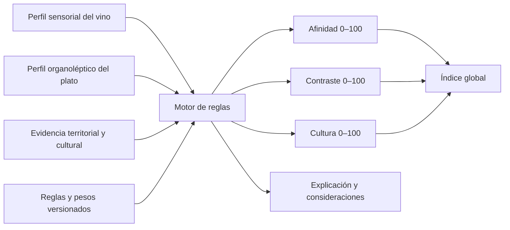
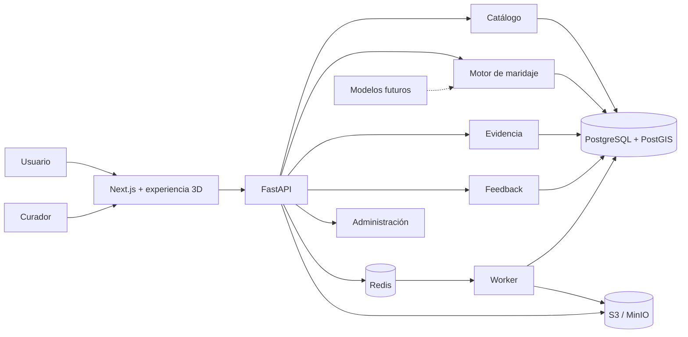

# SaraProject — Maridaje boliviano inteligente

Plataforma web educativa, turística y científica para descubrir maridajes entre vinos bolivianos y gastronomía boliviana mediante perfiles sensoriales, reglas explicables, información territorial y una experiencia interactiva 3D de Bolivia.

> Estado: arquitectura inicial y scaffolding del monorepo. El producto todavía no está terminado ni listo para producción.

## Visión

SaraProject busca transformar conocimiento disperso sobre vinos, gastronomía, fermentaciones, territorio y patrimonio boliviano en una experiencia digital comprensible.

El usuario podrá recorrer un mapa 3D de Bolivia, entrar a un departamento o valle, conocer vinos y platos regionales y descubrir por qué una combinación funciona mediante tres dimensiones independientes:

- **Afinidad o complemento:** atributos semejantes o compatibles.
- **Contraste favorable:** atributos del vino que equilibran el plato.
- **Compatibilidad cultural:** relación territorial, histórica o patrimonial.

La plataforma no mostrará únicamente un porcentaje. Cada recomendación deberá explicar qué atributos coinciden, cuáles contrastan, qué incompatibilidades podrían existir y qué evidencia respalda la relación cultural.

## Objetivos del proyecto

- Crear un catálogo progresivamente ampliable de vinos bolivianos.
- Crear un catálogo de platos y variantes gastronómicas de los nueve departamentos.
- Estandarizar vocabulario sensorial, organoléptico y bioquímico.
- Recomendar platos a partir de un vino.
- Recomendar vinos a partir de un plato.
- Explorar vinos, platos, bodegas y patrimonio mediante un mapa 3D.
- Explicar científicamente cada maridaje.
- Recopilar evaluaciones de expertos y consumidores con consentimiento.
- Conservar datos útiles para investigación académica.
- Incorporar aprendizaje automático sólo cuando exista evidencia suficiente.

## Experiencias principales

### Tengo este vino

El usuario selecciona un vino y, cuando corresponda, una añada. El sistema devuelve platos bolivianos ordenados por compatibilidad, con puntuaciones parciales y explicación.

### Tengo este plato

El usuario selecciona una preparación o variante regional. El sistema presenta los vinos más adecuados y las razones sensoriales y culturales.

### Explorar Bolivia

El usuario navega desde el país hacia departamentos, municipios, valles, bodegas, vinos y platos. La URL conservará el estado de navegación para permitir compartir y recuperar cada recorrido.

```text
Bolivia
  └── Departamento
      └── Región o valle
          ├── Bodegas y vinos
          ├── Platos y variantes
          └── Maridajes culturales
```

### Aprender

Una sección educativa relacionará descriptores sensoriales con compuestos, microorganismos y procesos. Ejemplos:

- ésteres con aromas frutales;
- terpenos con aromas florales y cítricos;
- taninos con astringencia y estructura;
- glicerol con volumen y untuosidad;
- diacetilo con notas de mantequilla;
- fermentación maloláctica con menor acidez y mayor redondez;
- compuestos del roble con vainilla, tostado, humo y especias.

## Experiencia 3D de Bolivia

El corazón visual será un mapa tridimensional interactivo construido a partir de geometría geográfica verificada.

La experiencia contemplará:

- nueve departamentos extruidos y seleccionables;
- relieve estilizado y, posteriormente, elevación geográfica;
- viajes animados de cámara;
- zoom y rotación controlada;
- marcadores de bodegas, viñedos, vinos, platos y patrimonio;
- conexión visual entre vino, alimento y territorio;
- carga progresiva por región y nivel de detalle;
- alternativa 2D accesible;
- modo reducido para móviles y dispositivos con poca capacidad gráfica.

PostGIS conservará la geometría de mayor fidelidad. El frontend recibirá GeoJSON simplificado y lo convertirá en mallas Three.js. Blender se reservará para objetos decorativos como botellas o elementos culturales; nunca será la autoridad de límites territoriales.

## Cómo funcionará una recomendación



El motor inicial será determinista y versionado. Una ejecución conservará:

- versión de los perfiles evaluados;
- versión de reglas y pesos;
- contribuciones positivas y negativas;
- puntuaciones parciales;
- cobertura y confianza de los datos;
- explicación utilizada;
- identificador reproducible de la recomendación.

Los datos faltantes no se tratarán como cero. El sistema mostrará cobertura y confianza para evitar una precisión falsa.

## Estrategia de inteligencia artificial

### Etapa 1 — Conocimiento experto

La primera versión utilizará reglas sensoriales revisadas por especialistas. Ejemplos:

- cuerpo del vino frente a intensidad del plato;
- acidez frente a grasa;
- dulzor frente a picor;
- burbujas frente a fritura;
- taninos frente a proteínas;
- aromas tostados frente a asado o parrilla;
- relación territorial documentada.

### Etapa 2 — Aprendizaje automático

Cuando existan evaluaciones suficientes se podrán entrenar modelos interpretables para mejorar el ordenamiento. Antes de influir en resultados deberán:

1. usar datasets versionados y anonimizados;
2. evitar fugas entre entrenamiento y prueba;
3. compararse contra el motor experto;
4. evaluarse por región, vino, plato y tipo de participante;
5. ejecutarse primero en `shadow mode`;
6. ofrecer explicación y rollback.

### IA generativa

Podrá ayudar a mapear fuentes, realizar búsquedas educativas o redactar una explicación basada en hechos calculados. No podrá crear el puntaje oficial, completar datos desconocidos como hechos ni inventar tradiciones culturales.

## Stack tecnológico

| Capa | Tecnología |
|---|---|
| Web | Next.js, React y TypeScript |
| 3D | Three.js, React Three Fiber y Drei |
| Animaciones | GSAP o React Spring |
| Cartografía | GeoJSON, PostGIS y MapLibre cuando sea necesario |
| Backend | Python, FastAPI, Pydantic y SQLAlchemy |
| Migraciones | Alembic |
| Base de datos | PostgreSQL |
| Geografía | PostGIS |
| Vectores futuros | pgvector |
| Caché y cola | Redis |
| Worker | Dramatiq inicialmente |
| Objetos | S3 en producción y MinIO localmente |
| ML futuro | scikit-learn, MLflow y SHAP |
| Contenedores | Docker y Docker Compose |
| Proxy y TLS | Caddy |
| CI/CD | GitHub Actions |
| Pruebas | Pytest, Vitest y Playwright |
| Observabilidad | logs estructurados, OpenTelemetry, métricas y alertas |

## Arquitectura general



El MVP será un monolito modular. No se utilizarán microservicios ni Kubernetes sin evidencia operativa que lo justifique.

## Estructura del repositorio

```text
SaraProject/
├── apps/
│   ├── web/                         aplicación Next.js y mapa 3D
│   ├── api/                         adaptador HTTP FastAPI
│   └── worker/                      procesos en segundo plano
├── backend/
│   ├── modules/
│   │   ├── catalog/                 vinos, platos, geografía y taxonomías
│   │   ├── pairing/                 reglas, puntajes y explicaciones
│   │   ├── evidence/                fuentes, afirmaciones y revisiones
│   │   ├── feedback/                evaluaciones, estudios y consentimiento
│   │   ├── admin/                   curación, publicación y auditoría
│   │   └── ml/                      contratos de IA futura
│   ├── platform/                    DB, caché, almacenamiento y observabilidad
│   ├── migrations/                  migraciones Alembic
│   └── tests/                       pruebas del dominio
├── packages/
│   ├── api-client/                  tipos y cliente OpenAPI
│   ├── ui/                          sistema de diseño compartido
│   └── config/                      configuración TypeScript y calidad
├── data/
│   ├── geography/                   geometría geográfica y licencias
│   ├── schemas/                     contratos de importación
│   ├── seeds/                       datos iniciales en borrador
│   └── taxonomy/                    vocabulario sensorial versionado
├── ml/
│   ├── pipelines/                   entrenamiento y evaluación futuros
│   └── tests/                       controles de calidad y sesgo
├── infra/
│   ├── docker/                      imágenes de servicios
│   ├── caddy/                       proxy y HTTPS
│   ├── compose/                     overlays por entorno
│   └── scripts/                     migración, backup y despliegue
├── docs/
│   ├── adr/                         decisiones de arquitectura
│   ├── api/                         contratos y convenciones
│   ├── data-dictionary/             definición de entidades y escalas
│   └── runbooks/                    procedimientos operativos
├── .github/workflows/               integración continua
├── compose.yaml
├── .env.example
├── pnpm-workspace.yaml
├── ARQUITECTURA.md
└── README.md
```

## Modelo de información

### Vinos

Se almacenarán, entre otros:

- vino, bodega, región, valle y municipio;
- altitud, cepas y composición del blend;
- añada;
- tipo de vino;
- fermentación y maloláctica;
- crianza, recipiente y duración;
- graduación alcohólica;
- apariencia, aromas, sabores y textura;
- dulzor, acidez, alcohol, taninos, astringencia, cuerpo, intensidad y persistencia;
- fuentes, confianza y revisión.

El vino comercial y su añada serán entidades diferentes para no convertir un perfil concreto en una propiedad permanente.

### Gastronomía

Se almacenarán:

- plato y variante regional;
- departamento, región y localidad;
- ingredientes dominantes;
- dulce, ácido, salado, amargo y umami;
- intensidad, grasa y picor;
- aromas y texturas;
- técnicas culinarias;
- fuentes y estado de revisión.

### Evidencia y versiones

Cada dato publicable deberá indicar origen, fecha, método, confianza, persona revisora y versión. Los estados editoriales serán:

```text
draft → in_review → approved → published → archived
```

## API prevista

| Método | Ruta | Descripción |
|---|---|---|
| `GET` | `/v1/wines` | catálogo y filtros de vinos |
| `GET` | `/v1/wines/{slug}` | ficha y perfil de vino |
| `GET` | `/v1/dishes` | catálogo de platos |
| `GET` | `/v1/dishes/{slug}` | ficha y variante gastronómica |
| `GET` | `/v1/regions` | departamentos, regiones y valles |
| `GET` | `/v1/map/markers` | marcadores visibles por región |
| `POST` | `/v1/pairings/recommendations` | recomendaciones en ambos sentidos |
| `GET` | `/v1/pairings/runs/{id}` | resultado reproducible |
| `POST` | `/v1/ratings` | evaluación de 1 a 5 |
| `POST` | `/v1/admin/imports` | importación controlada |
| `POST` | `/v1/admin/content/{id}/approve` | aprobación editorial |
| `POST` | `/v1/admin/content/{id}/publish` | publicación editorial |

Actualmente existe un endpoint demostrativo temporal para comprobar el contrato del motor antes de implementar el catálogo completo.

## Roles

| Rol | Responsabilidad |
|---|---|
| Visitante | consultar catálogos y recomendaciones |
| Usuario | evaluar y guardar favoritos |
| Investigador | trabajar con datasets autorizados y anonimizados |
| Curador | incorporar y revisar contenido |
| Publicador | aprobar publicación o retiro |
| Administrador | gestionar permisos, configuración y auditoría |

## Privacidad, seguridad e investigación

- autenticación mediante OpenID Connect;
- MFA para cuentas administrativas;
- RBAC y auditoría de acciones;
- HTTPS obligatorio;
- cookies seguras y protección CSRF;
- CORS y rate limiting restringidos;
- validación estricta de entradas y archivos;
- secretos fuera del repositorio;
- identidad separada de observaciones científicas;
- consentimiento versionado y revocable;
- exportaciones seudonimizadas;
- políticas de conservación y restauración probada.

## Desarrollo local

### Requisitos

- Node.js 22 o superior.
- pnpm 10 o superior.
- Python 3.12 o superior.
- Docker con Docker Compose.

### Configuración

En Linux o macOS:

```bash
cp .env.example .env
docker compose up --build
```

En PowerShell:

```powershell
Copy-Item .env.example .env
docker compose up --build
```

Antes de usar producción se deben reemplazar todas las credenciales indicadas como `change-me`.

### Servicios locales

| Servicio | Dirección |
|---|---|
| Web | `http://localhost:3000` |
| API | `http://localhost:8000` |
| OpenAPI | `http://localhost:8000/docs` |
| MinIO API | `http://localhost:9000` |
| MinIO Console | `http://localhost:9001` |

### Desarrollo web sin levantar todo

```bash
pnpm install
pnpm dev
```

### Pruebas del dominio Python

Desde la raíz:

```bash
PYTHONPATH=backend pytest backend/tests
```

En PowerShell:

```powershell
$env:PYTHONPATH = "backend"
pytest backend/tests
```

## Despliegue previsto

### Entornos

- **Local:** todos los servicios mediante Docker Compose.
- **Preview:** entorno temporal por pull request.
- **Staging:** configuración equivalente a producción con datos sintéticos o anonimizados.
- **Producción:** contenedores Linux, HTTPS, datos protegidos y backups externos.

### Topología inicial

```text
Internet
   ↓
Caddy / HTTPS
   ├── Next.js
   └── FastAPI
          ├── Worker
          ├── PostgreSQL + PostGIS + pgvector
          ├── Redis
          └── S3
```

No se utilizará Kubernetes en el MVP. Primero se escalarán consultas, caché, recursos y réplicas de procesos.

## Estrategia de calidad

- pruebas unitarias de cada regla;
- casos dorados validados por especialistas;
- pruebas de propiedades y límites 0–100;
- pruebas de integración con PostgreSQL y Redis;
- verificación del contrato OpenAPI;
- pruebas de componentes y accesibilidad;
- recorridos E2E de las tres modalidades;
- análisis de dependencias, secretos y contenedores;
- pruebas de migración, backup y restauración.

## Roadmap

### Fase 0 — Fundaciones

- [x] Documento inicial de arquitectura.
- [x] Estructura del monorepo.
- [x] Contrato mínimo del motor.
- [x] Docker Compose inicial.
- [x] ADR sobre monolito, explicabilidad y geografía.
- [ ] Validar escalas sensoriales con especialistas.
- [ ] Definir casos dorados y casos negativos.

### Fase 1 — Catálogos

- [ ] Modelo relacional y migraciones.
- [ ] Bodegas, vinos y añadas.
- [ ] Platos y variantes regionales.
- [ ] Regiones, valles y municipios.
- [ ] Fuentes, revisiones y publicación.
- [ ] Importación inicial del documento como borrador.

### Fase 2 — Mapa 3D

- [ ] Obtener GeoJSON con fuente y licencia.
- [ ] Validar y simplificar los nueve departamentos.
- [ ] Extruir departamentos con Three.js.
- [ ] Selección, hover y viajes de cámara.
- [ ] Tarija, Chuquisaca, Cinti y Valle Central.
- [ ] Marcadores conectados con la API.
- [ ] Modo 2D y rendimiento móvil.

### Fase 3 — Recomendación explicable

- [ ] Reglas versionadas.
- [ ] Afinidad, contraste, cultura e incompatibilidades.
- [ ] Cobertura y confianza.
- [ ] Vino hacia platos y plato hacia vinos.
- [ ] Snapshots reproducibles.
- [ ] Explicaciones estructuradas y fuentes.

### Fase 4 — Educación y participación

- [ ] Compuestos y procesos bioquímicos.
- [ ] Microorganismos y fermentaciones.
- [ ] Cuentas, favoritos y evaluaciones.
- [ ] Consentimiento y estudios.
- [ ] Exportaciones académicas anonimizadas.

### Fase 5 — Aprendizaje automático

- [ ] Dataset versionado.
- [ ] Baseline interpretable.
- [ ] Evaluación y análisis de sesgos.
- [ ] Shadow deployment.
- [ ] Ranking híbrido controlado.
- [ ] Monitoreo de desempeño y deriva.

## Estado actual

Ya existe:

- estructura de 80 archivos;
- monorepo web/Python;
- escena 3D arquitectónica temporal;
- interfaz inicial de exploración;
- FastAPI con endpoints de salud;
- endpoint demostrativo del motor;
- puntuaciones separadas de afinidad, contraste y cultura;
- reglas iniciales de cuerpo/intensidad y acidez/grasa;
- esquemas JSON de importación;
- taxonomía sensorial inicial;
- infraestructura local con Docker Compose;
- PostgreSQL preparado para PostGIS y pgvector;
- Redis y MinIO;
- Dockerfiles, Caddy y CI inicial;
- documentación de decisiones arquitectónicas.

Todavía falta:

- reemplazar la geometría temporal por el mapa oficial;
- implementar persistencia y migraciones reales;
- cargar y revisar el dataset inicial;
- construir los catálogos completos;
- implementar autenticación y panel administrativo;
- ampliar y validar las reglas con especialistas;
- completar pruebas, observabilidad y despliegue productivo.

## Documentación

- [Arquitectura completa](./ARQUITECTURA.md)
- [Dominio backend](./backend/README.md)
- [Mapa 3D](./apps/web/src/features/bolivia-map/README.md)
- [Datos](./data/README.md)
- [Geografía](./data/geography/README.md)
- [Aprendizaje automático](./ml/README.md)
- [Decisiones arquitectónicas](./docs/adr/README.md)
- [Contrato API](./docs/api/README.md)
- [Runbooks](./docs/runbooks/README.md)

## Principios no negociables

1. No inventar atributos sensoriales, fuentes o tradiciones.
2. No ocultar las puntuaciones parciales dentro de un único porcentaje.
3. No usar un LLM como autoridad del puntaje.
4. No publicar una importación sin revisión humana.
5. No mezclar una valoración informal con un panel científico controlado.
6. No asumir que un perfil de añada representa permanentemente a un vino.
7. No modelar límites territoriales manualmente cuando existe geometría verificable.
8. No recolectar datos personales sin finalidad y consentimiento definidos.

## Documentación fuente

La especificación funcional inicial procede del documento `ENOLOGIA - IA.docx`. Su contenido debe transformarse en registros de borrador con fuentes y revisión; no se considera automáticamente una base de datos científica publicada.

## Licencia

Pendiente de definición. Antes de publicar código, datos, cartografía, fotografías o modelos 3D deberá acordarse una licencia y verificarse la compatibilidad de cada recurso incorporado.
